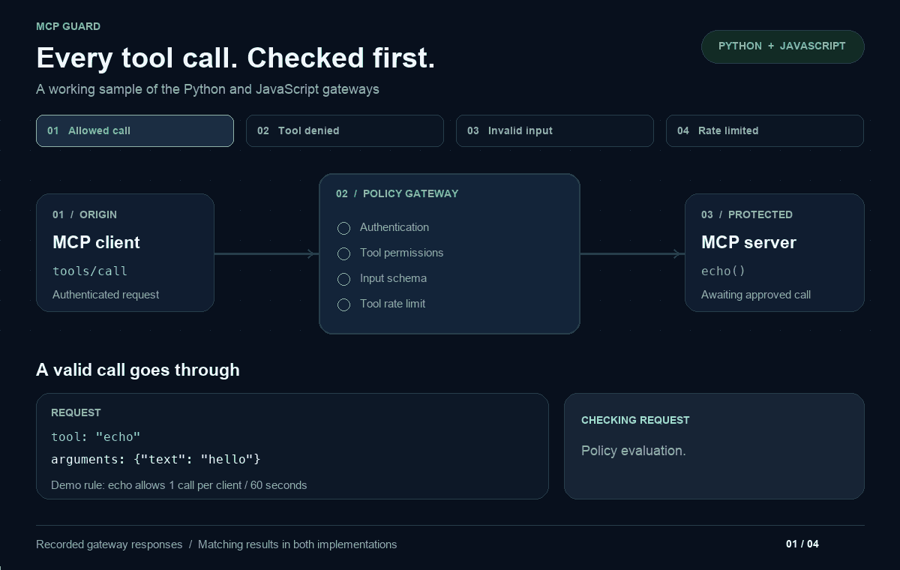

# Animated working sample



This looping GIF replays **recorded responses from both implementations**, using in-process requests against each gateway and its demo upstream. It is an animation of the results, not a live connection or a screen recording.

| Call | Expected response | Forwarded upstream |
| --- | --- | --- |
| `echo({"text":"hello"})` | 200 — allowed | Yes |
| `admin_reset({})` | 403 — tool denied | No |
| `echo({"text":42})` | 400 — invalid input | No |
| `echo({"text":"hello again"})` | 429 — rate limited | No |

The animation uses a temporary demo policy allowing one echo call per client per 60 seconds. It does not modify either project's saved policy. Both implementations must return the expected statuses and forwarding decisions before the GIF is generated.

- [Animated GIF](mcp-guard-demo.gif) — 1200 × 760, approximately 21 seconds, looping.
- [Poster](mcp-guard-demo-poster.png) — static allowed-call frame.
- [Recorded responses](recorded-responses.json) — actual response bodies and forwarding decisions.
- [Generator](generate_demo.py) — repeatable collection and rendering.

To regenerate, install the Python project's dependencies plus Pillow and run `npm ci` in `javascript/`. From the repository root:

```sh
python3 docs/demo/generate_demo.py
```

Rendering uses code-drawn diagrams and local fonts; it does not require an image generation API or a network listener.
